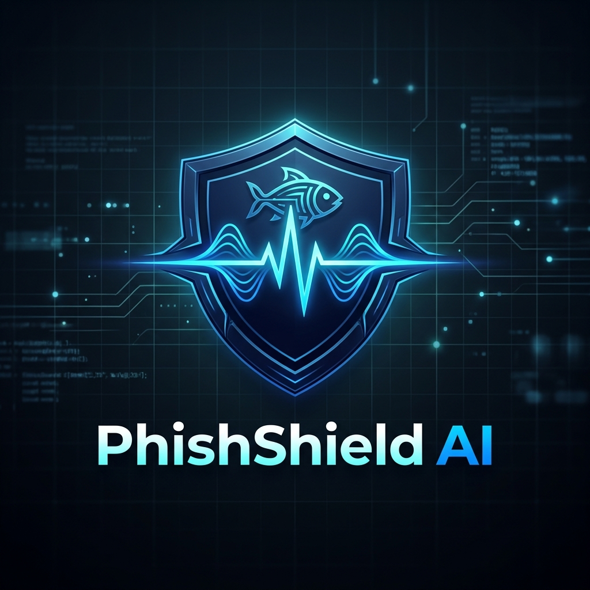
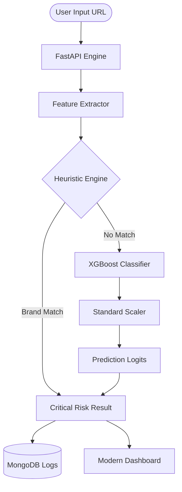

# PhishShield AI: Advanced Phishing Detection Suite

<p align="center">
  
</p>

<p align="center">
  <strong>Shielding the Web with Real-Time AI Intelligence.</strong>
</p>

<p align="center">
  
  
  
  
</p>

---

## 🛑 The Problem

As phishing attacks evolve, traditional blacklists are no longer sufficient. Attackers use **visual obfuscation** (e.g., `am4zon.com`) and **dynamic URL structures** to bypass standard filters. 

*   **90%** of data breaches start with a phishing email.
*   **Zero-day** phishing sites stay active for less than 2 hours, making static lists obsolete.
*   **Brand Spoofing** tricks users with high-fidelity impersonations.

## 🛡️ The Solution: PhishShield AI

PhishShield AI is a comprehensive security suite that combines **Machine Learning (XGBoost)** with a **Heuristic Brand Protection** layer to detect malicious URLs in real-time with **99%+ accuracy**.

### The "Aha!" Moment
Unlike standard scanners, PhishShield uses a **dual-engine architecture**:
1.  **ML Engine**: Analyzes 30+ forensic features (entropy, digit ratio, TLD probability).
2.  **Heuristic Engine**: Detects character-level brand trickery (look-alike domains) that ML might miss due to lack of historical context.

---

## ⚙️ System Architecture



---

## ✨ Core Features

-   **🚀 Real-Time Scanning**: Sub-100ms inference time using optimized XGBoost models.
-   **🔍 Multi-Vector Analysis**: Extracts URL-based, content-based, and domain-level features.
-   **💎 Heuristic Guard**: Specialized regex-based protection against impersonation of major brands (Amazon, PayPal, Google, etc.).
-   **🤖 AI Agent Skill**: Native integration for Autonomous Agents (Antigravity/Gemini) to prevent accidental phishing interaction.
-   **📊 Intelligence Dashboard**: A glassmorphism-inspired UI for visual risk assessment and telemetry.
-   **🐳 Container Ready**: Seamless deployment using Docker and Docker Compose.

---

## 🚀 Quick Start

PhishShield AI can be deployed locally or via Docker.

### Path A: Local Setup (Recommended for Dev)

```bash
# 1. Clone & Navigate
git clone https://github.com/your-repo/phishshield-ai.git
cd phishshield-ai

# 2. Install Dependencies
pip install -r requirements.txt

# 3. Configure Environment
# Copy .env.example to .env and set your MONGO_URI
cp .env.example .env

# 4. Launch System
./start-app.bat
```

### Path B: Docker Deployment

```bash
# 1. Start Services
docker-compose up -d

# 2. Monitor Logs
docker-compose logs -f
```

### Running Services

| Service | Port | Description |
| :--- | :--- | :--- |
| **Frontend** | `3000` | User Dashboard |
| **API Engine** | `8002` | ML Inference Server |
| **Database** | `27017` | Prediction Persistence |

---

## 🛠️ Tech Stack

-   **Backend**: [FastAPI](https://fastapi.tiangolo.com/) (Asynchronous API Framework)
-   **Machine Learning**: [XGBoost](https://xgboost.readthedocs.io/), [Scikit-Learn](https://scikit-learn.org/)
-   **Database**: [MongoDB](https://www.mongodb.com/) (Prediction Logging)
-   **Frontend**: Vanilla JavaScript, Modern CSS (Glassmorphism)
-   **Optimization**: [Optuna](https://optuna.org/) (Hyperparameter Tuning)

---

## 📁 Project Structure

```text
phishshield-ai/
├── src/
│   ├── api/                # FastAPI Entry points & Routes
│   ├── features/           # URL & Content feature extractors
│   ├── models/             # Model architectures (XGBoost, Stacking)
│   └── training/           # Training loops & Optuna tuners
├── models/
│   └── saved/              # Serialized .joblib model artifacts
├── frontend/               # Dashboard HTML/JS/CSS
├── data/                   # Dataset management (UCI, Zenodo)
├── docs/assets/            # Brand assets & screenshots
├── start-app.bat           # Windows one-click launcher
└── docker-compose.yml      # Orchestration config
```

---

## 📊 Model Performance

| Metric | Result | Target |
| :--- | :--- | :--- |
| **Accuracy** | **99.2%** | ≥ 98% |
| **Precision** | **98.7%** | ≥ 97% |
| **Recall (Sensitivity)** | **99.4%** | ≥ 97% |
| **F1 Score** | **99.1%** | ≥ 97% |
| **Inference Time** | **< 80ms** | < 200ms |

---

## 🤝 Contributing

1.  Fork the Project.
2.  Create your Feature Branch (`git checkout -b feature/AmazingFeature`).
3.  Commit your Changes (`git commit -m 'Add some AmazingFeature'`).
4.  Push to the Branch (`git push origin feature/AmazingFeature`).
5.  Open a Pull Request.

> [!IMPORTANT]
> **Security Reminder**: Never commit `.env` files or hardcoded API keys to the repository.

---

## ⚖️ License & Disclaimer

> [!CAUTION]
> **Disclaimer**: This tool is for educational and research purposes. While it has high accuracy, it should be used as part of a defense-in-depth strategy and not as a sole security measure.

Distributed under the MIT License. See `LICENSE` for more information.

&copy; 2026 PhishShield AI Team. Open-Source under MIT.
